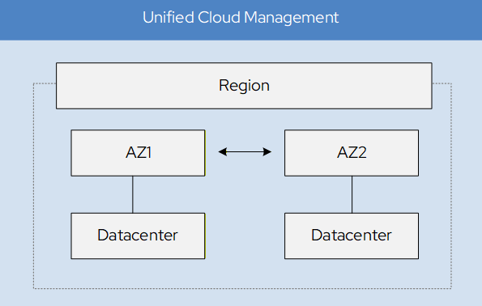

# SovereignSecure Cloud Platform Architecture

<figure markdown="span">
  { width="600"}
  <figcaption>Deployment Architecture</figcaption>
</figure>

The SovereignSecure Cloud platform is engineered to deliver a secure, compliant, and high-performance cloud environment. Our architecture is built upon a robust foundation of open-source technologies, primarily OpenStack, and designed with data sovereignty and operational autonomy at its core. This document outlines the key architectural layers and components that constitute the SovereignSecure Cloud.

---

## Core Architectural Principles

Our platform is designed around the following principles:

*   **Modularity:** Components are loosely coupled, allowing for independent scaling and upgrades.
*   **Scalability:** Designed to scale horizontally to meet growing demand for compute, storage, and networking resources.
*   **Security-by-Design:** Every layer incorporates security measures, from physical hardware to software-defined policies.
*   **Open Source Foundation:** Leveraging OpenStack and other open-source projects ensures transparency, auditability, and avoids vendor lock-in.
*   **High Availability:** Critical services are deployed in a redundant manner across multiple availability zones to ensure continuous operation.

---

## Architectural Layers

The SovereignSecure Cloud architecture can be broadly categorized into three main layers:

### 1. Physical Infrastructure (Underlay)

This layer comprises the foundational hardware components that provide the raw compute, storage, and networking capabilities. It is the physical backbone upon which the entire software-defined cloud is built.

#### Generic Node Requirements
Standard enterprise-grade servers form the basis of our cloud nodes. While specific configurations vary by role, general requirements include:

### Network Switches
The network infrastructure typically relies on high-performance switches supporting modern protocols:

* **Management Switch:** 1 GbE or 10 GbE for out-of-band management (IPMI/BMC).
* **Data/Leaf Switches:** 25 GbE or 100 GbE switches (e.g., Celestica, Edgecore, or Dell) running **SONiC** or other open network operating systems.

---

### 2. Software-Defined Infrastructure (SDI) - The Cloud Fabric

This layer virtualizes and orchestrates the physical resources, presenting them as a unified, programmable cloud. OpenStack serves as the core Infrastructure as a Service (IaaS) platform, managing and exposing these resources via APIs.

#### Management Plane
The management plane is responsible for the overall orchestration, deployment, and lifecycle management of the cloud infrastructure itself.

*   **Manager Nodes:** These nodes run essential services for cloud operations, including:
    *   **Ansible:** For automated configuration management and deployment.
    *   **Docker Registry:** To store and distribute container images for internal services.
    *   **Netbox:** For IP Address Management (IPAM) and Data Center Infrastructure Management (DCIM).
    *   **Observability & Security Tools:** For monitoring, logging, and security event management of the cloud platform.

#### Control Plane
The control plane provides the core APIs and services that users interact with to provision and manage their cloud resources.

*   **Control Nodes:** These nodes host critical OpenStack services:
    *   **OpenStack APIs (Keystone, Nova, Neutron, Cinder, Glance, etc.):** The entry points for all cloud operations.
    *   **Databases (e.g., MariaDB, PostgreSQL):** Store the state and configuration of the cloud.
    *   **Message Queues (e.g., RabbitMQ):** Facilitate communication between various OpenStack services.
    *   **Specifications:** Typically require 16+ Cores CPU, 128 GB - 256 GB RAM, and RAID 1 NVMe for system/databases.

#### Compute Plane
The compute plane is where user workloads (virtual machines) are executed.

*   **Compute Nodes:** These nodes run the OpenStack Nova service, hosting virtual machines (VMs).
    *   **Specifications:** Feature high core count CPUs for VM density, 256 GB - 1 TB+ RAM depending on workload, and dual-port 25/100 GbE NICs.

#### Storage Plane
The storage plane provides persistent and highly available storage for all cloud resources.

*   **Storage Nodes (Ceph OSDs):** These nodes form the distributed storage backend, powered by Ceph. They provide block storage (OpenStack Cinder), object storage (S3-compatible), and shared file systems (CephFS).
    *   **Specifications:** Typically 8-16 Cores CPU, 64 GB - 128 GB RAM (~1 GB RAM per 1 TB of OSD storage), and 4-12+ NVMe or SAS/SATA SSDs for data, with dedicated NVMe for WAL/DB.

#### Networking Plane
The networking plane provides virtual networking capabilities, enabling isolated and secure communication for tenant resources.

*   **Network Nodes:** These nodes manage the software-defined networking (SDN) components, including:
    *   **OpenStack Neutron:** The primary networking service for creating virtual networks, subnets, routers, and security groups.
    *   **OVN (Open Virtual Network):** Provides the virtual overlay network, enabling distributed routing and security group enforcement at the hypervisor level.

---

### 3. Platform as a Service (PaaS) Layer

Built on top of the SDI layer, the PaaS layer offers higher-level services that abstract away infrastructure management, allowing users to focus on application development.

*   **Container Orchestration (KaaS):** Managed Kubernetes services for deploying and scaling containerized applications.
*   **Database as a Service (DBaaS):** Fully managed relational and NoSQL database offerings.
*   Other specialized services like AI/ML platforms, messaging queues, etc.

---

## 3. Specific Role Configurations

### Control Nodes
* **CPU:** 16+ Cores.
* **RAM:** 128 GB - 256 GB.
* **Disk:** RAID 1 NVMe for system/databases.

### Compute Nodes
* **CPU:** High core count for VM density.
* **RAM:** 256 GB - 1 TB+ depending on workload requirements.
* **NIC:** Dual-port 25/100 GbE.

### Storage Nodes (Ceph)
* **CPU:** 8-16 Cores.
* **RAM:** 64 GB - 128 GB (Rule of thumb: ~1 GB RAM per 1 TB of OSD storage).
* **Disk:** 4-12+ NVMe or SAS/SATA SSDs for data; dedicated NVMe for WAL/DB.

---

## 4. Software Stack Summary

| Layer | Recommended Component |
 | :--- | :--- |
 | **Operating System** | Ubuntu 24.04 LTS |
 | **IaaS** | OpenStack |
 | **SDS (Storage)** | Ceph |
 | **SDN (Network)** | SONiC & OVN |
 | **Kubernetes** | K3s |
 | **Identity Management** | Keycloak |

