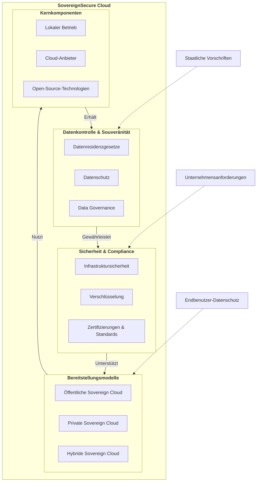

# Willkommen bei der SovereignSecure Cloud Dokumentation

Willkommen bei der SovereignSecure Cloud, Ihrer vertrauenswürdigen Plattform für sichere, konforme und hochleistungsfähige Cloud-Dienste. Aufgebaut auf einem OpenStack-Fundament und erweitert durch ManageIQ für umfassendes Cloud-Management, befähigen wir Organisationen, die volle Kontrolle über ihre Daten und Abläufe in einer souveränen digitalen Umgebung zu behalten.

## Unser Engagement für Souveränität

Die SovereignSecure Cloud wurde entwickelt, um die strengen Anforderungen der Datensouveränität zu erfüllen und sicherzustellen, dass Ihre Daten innerhalb bestimmter geografischer und rechtlicher Zuständigkeiten bleiben. Wir erreichen dies durch:

*   **Datenresidenz:** Ihre Daten werden ausschließlich in festgelegten Regionen gespeichert und verarbeitet, unter Einhaltung lokaler Vorschriften.
*   **Betriebliche Autonomie:** Unsere Infrastruktur und unser Betrieb werden von lokalen Teams verwaltet, was Transparenz und Kontrolle gewährleistet.
*   **Open-Source-Fundament:** Die Nutzung von OpenStack und anderen Open-Source-Technologien minimiert den Vendor-Lock-in und bietet einen transparenten, auditierbaren Stack.
*   **Robuste Sicherheit & Compliance:** Wir implementieren fortschrittliche Sicherheitsmaßnahmen und unterhalten Zertifizierungen, um Ihre sensiblen Workloads zu schützen.

## Services Overview

-   :material-server:{ .lg .middle } __Compute__

    ---

    Scalable virtual machines, dedicated hosts, and high-performance computing resources.

    [:octicons-arrow-right-24: Explore Compute](product_content/compute.md)

-   :material-network:{ .lg .middle } __Networking__

    ---

    Virtual private clouds, load balancers, DNS, and content delivery networks.

    [:octicons-arrow-right-24: Explore Networking](product_content/networking.md)

-   :material-harddisk:{ .lg .middle } __Storage__

    ---

    Secure, durable, and scalable object, block, and file storage solutions.

    [:octicons-arrow-right-24: Explore Storage](product_content/storage.md)

-   :material-kubernetes:{ .lg .middle } __Containers__

    ---

    Run and manage containers with high reliability and scalability.

    [:octicons-arrow-right-24: Explore Containers](product_content/containers.md)

-   :material-database:{ .lg .middle } __Databases__

    ---

    Fully managed relational, NoSQL, and in-memory databases.

    [:octicons-arrow-right-24: Explore Databases](product_content/databases.md)

-   :material-chart-bar:{ .lg .middle } __Analytics__

    ---

    Get insights from your data with warehousing, processing, and visualization tools.

    [:octicons-arrow-right-24: Explore Analytics](product_content/analytics.md)

-   :material-robot-outline:{ .lg .middle } __AI + Machine Learning__

    ---

    Build, train, and deploy machine learning models with ease.

    [:octicons-arrow-right-24: Explore AI & ML](product_content/ai-machine-learning.md)

-   :material-api:{ .lg .middle } __API__

    ---

    Deploy API Gateway securely and at scale.

    [:octicons-arrow-right-24: Explore API](product_content/api.md)

-   :material-puzzle-outline:{ .lg .middle } __Integration__

    ---

    Seamlessly connect applications, data, and devices across your enterprise.

    [:octicons-arrow-right-24: Explore Integration](product_content/integration.md)

-   :material-shield-account-outline:{ .lg .middle } __Identity__

    ---

    Manage user identities, access policies, and secure authentication.

    [:octicons-arrow-right-24: Explore Identity](product_content/identity.md)

-   :material-security:{ .lg .middle } __Security__

    ---

    Protect your infrastructure and data with advanced security services.

    [:octicons-arrow-right-24: Explore Security](product_content/security.md)

-   :material-infinity:{ .lg .middle } __DevOps__

    ---

    Automate software delivery and infrastructure management.

    [:octicons-arrow-right-24: Explore DevOps](product_content/devops.md)

-   :material-briefcase-check-outline:{ .lg .middle } __Management and Governance__

    ---

    Control costs, compliance, and configuration of your cloud resources.

    [:octicons-arrow-right-24: Explore Management](product_content/management-governance.md)

-   :material-cloud-upload-outline:{ .lg .middle } __Migration__

    ---

    Simplify and accelerate your migration to the cloud.

    [:octicons-arrow-right-24: Explore Migration](product_content/migration.md)

## Erkunden Sie die Dokumentation

Verwenden Sie die Navigation auf der linken Seite, um unsere umfassenden Leitfäden zu erkunden:

## Hauptbereiche

-   :material-rocket-launch:{ .lg .middle } __Erste Schritte__

    ---

    Eine Schritt-für-Schritt-Anleitung für neue Benutzer, um sich schnell einzuarbeiten und erste Ressourcen bereitzustellen.

    [:octicons-arrow-right-24: Schnellstart](quickstart/index.md)

-   :material-monitor-dashboard:{ .lg .middle } __Cloud-Management (CMP)__

    ---

    Erfahren Sie, wie Sie das ManageIQ-Portal für Self-Service-Bereitstellungen, Kataloge und Berichte verwenden.

    [:octicons-arrow-right-24: CMP Übersicht](cmp/index.md)

-   :material-server-network:{ .lg .middle } __Kerndienste__

    ---

    Tauchen Sie tief in unsere Compute-, Storage- und Netzwerkangebote ein, einschließlich GPU-Instanzen.

    [:octicons-arrow-right-24: Dienste erkunden](compute/index.md)

-   :material-api:{ .lg .middle } __API & Automatisierung__

    ---

    Integrieren Sie unsere Plattform mithilfe nativer OpenStack-APIs und IaC-Tools wie Terraform.

    [:octicons-arrow-right-24: API Übersicht](api/index.md)

