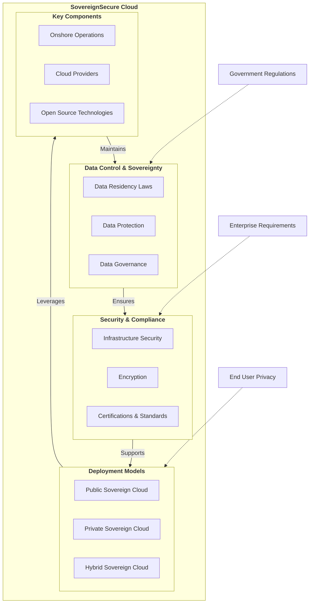

# Welcome to SovereignSecure Cloud Documentation

Welcome to SovereignSecure Cloud, your trusted platform for secure, compliant, and high-performance cloud services. Built on a foundation of OpenStack and enhanced with ManageIQ for comprehensive cloud management, we empower organizations to maintain full control over their data and operations within a sovereign digital environment.

## Our Commitment to Sovereignty

SovereignSecure Cloud is designed to meet the stringent requirements of data sovereignty, ensuring that your data remains within specified geographical and legal jurisdictions. We achieve this through:

*   **Data Residency:** Your data is stored and processed exclusively in designated regions, adhering to local regulations.
*   **Operational Autonomy:** Our infrastructure and operations are managed by local teams, ensuring transparency and control.
*   **Open Source Foundation:** Leveraging OpenStack and other open-source technologies minimizes vendor lock-in and provides a transparent, auditable stack.
*   **Robust Security & Compliance:** We implement advanced security measures and maintain certifications to protect your sensitive workloads.

!!! Question "FAQs"
    **1. Can the Cloud be publicly accessed?**

    Yes. The Cloud can be publicly accessed over a secure VPN tunnel, and only authorised personnel will have access to the platform.

    **2. How many data centers are available in Brazil?**

    The solution is supported by two data centers in Brazil: the Elea Data Center in Brasília and the Equinix Data Center in São Paulo. These two locations provide regional redundancy and ensure that customer demand can be met reliably. Customers can access, provision, and consume services via a secure public link, with access restricted to authorised personnel only.

    **3. Can TCS provide an off‑the‑shelf solution installed directly within Customer's data center?**

    Yes. TCS can deliver an off‑the‑shelf, plug‑and‑play solution that is fully installed within the customer’s data center. The customer provides facilities and connectivity, while TCS supplies the integrated hardware, software, and services—allowing the customer to power it on and begin consuming the services immediately.

    **4. Can the solution continue to operate and be managed if disconnected from the Internet?**

    Yes. The solution can continue to function and be managed even during a disconnection from the Internet. It supports multiple operational modes including fully connected, semi‑connected, and air‑gapped ensuring that services can still be delivered and administered in the event of an internet outage.

## Deployment Models

| Feature | TCS SovereignSecure Cloud | SovereignSecure Cloud Local |SovereignSecure Cloud Managed | 
| :--- | :--- | :--- | :--- |
| **Location** | TCS's Data Center | **Your DC or Your chosen DC** | **Your DC or Your chosen DC** |
| **Hardware Ownership** | TCS | Your Organization | **TCS** |
| **Cloud Platform Technical Stack Ownership** | TCS | TCS or Your Organization | TCS |
| **Tenancy** | **Multi-tenant** (Shared) or **(Dedicated)** | **Single-tenant** (Dedicated) | **Single-tenant** (Dedicated) |
| **Scalability** | High | Limited by owned hardware | High |
| **Control** | Medium | High  | High |
| **Management** | TCS Managed |  Your Organization*  | TCS Managed |
| **Cost Model** | OpEx (Pay-as-you-go) | Mixed/ OpEx  | OpEx (Pay-as-you-go) |
| **Security** | Shared Responsibility** | Full Internal Control |  Full Internal Control |

<small>_\* TCS will perform a Build, Operate, and Transfer model_</small>  
<small>_\*\* Up to the platform level is managed by TCS, beyond the platform is the customer's responsibility_</small>

## Services Overview

-   :material-server:{ .lg .middle } __Compute__

    ---

    Scalable virtual machines, dedicated hosts, and high-performance computing resources.

    [:octicons-arrow-right-24: Explore Compute](product_content/compute.md)

-   :material-network:{ .lg .middle } __Networking__

    ---

    Virtual private clouds, load balancers, DNS, and content delivery networks.

    [:octicons-arrow-right-24: Explore Networking](product_content/networking.md)

-   :material-harddisk:{ .lg .middle } __Storage__

    ---

    Secure, durable, and scalable object, block, and file storage solutions.

    [:octicons-arrow-right-24: Explore Storage](product_content/storage.md)

-   :material-kubernetes:{ .lg .middle } __Containers__

    ---

    Run and manage containers with high reliability and scalability.

    [:octicons-arrow-right-24: Explore Containers](product_content/containers.md)

-   :material-database:{ .lg .middle } __Databases__

    ---

    Fully managed relational, NoSQL, and in-memory databases.

    [:octicons-arrow-right-24: Explore Databases](product_content/databases.md)

-   :material-chart-bar:{ .lg .middle } __Analytics__

    ---

    Get insights from your data with warehousing, processing, and visualization tools.

    [:octicons-arrow-right-24: Explore Analytics](product_content/analytics.md)

-   :material-robot-outline:{ .lg .middle } __AI + Machine Learning__

    ---

    Build, train, and deploy machine learning models with ease.

    [:octicons-arrow-right-24: Explore AI & ML](product_content/ai-machine-learning.md)

-   :material-api:{ .lg .middle } __API__

    ---

    Deploy API Gateway securely and at scale.

    [:octicons-arrow-right-24: Explore API](product_content/api.md)

-   :material-puzzle-outline:{ .lg .middle } __Integration__

    ---

    Seamlessly connect applications, data, and devices across your enterprise.

    [:octicons-arrow-right-24: Explore Integration](product_content/integration.md)

-   :material-shield-account-outline:{ .lg .middle } __Identity__

    ---

    Manage user identities, access policies, and secure authentication.

    [:octicons-arrow-right-24: Explore Identity](product_content/identity.md)

-   :material-security:{ .lg .middle } __Security__

    ---

    Protect your infrastructure and data with advanced security services.

    [:octicons-arrow-right-24: Explore Security](product_content/security.md)

-   :material-infinity:{ .lg .middle } __DevOps__

    ---

    Automate software delivery and infrastructure management.

    [:octicons-arrow-right-24: Explore DevOps](product_content/devops.md)

-   :material-briefcase-check-outline:{ .lg .middle } __Management and Governance__

    ---

    Control costs, compliance, and configuration of your cloud resources.

    [:octicons-arrow-right-24: Explore Management](product_content/management-governance.md)

-   :material-cloud-upload-outline:{ .lg .middle } __Migration__

    ---

    Simplify and accelerate your migration to the cloud.

    [:octicons-arrow-right-24: Explore Migration](product_content/migration.md)

## Explore the Documentation

Use the navigation on the left to explore our comprehensive guides:

## Key Sections

-   :material-rocket-launch:{ .lg .middle } __Getting Started__

    ---

    A step-by-step guide for new users to quickly onboard and deploy their first resources.

    [:octicons-arrow-right-24: Quick Start](quickstart/index.md)

-   :material-monitor-dashboard:{ .lg .middle } __Cloud Management (CMP)__

    ---

    Learn how to use the ManageIQ portal for self-service provisioning, catalogs, and reporting.

    [:octicons-arrow-right-24: CMP Overview](cmp/index.md)

-   :material-server-network:{ .lg .middle } __Core Services__

    ---

    Deep dive into our Compute, Storage, and Networking offerings, including GPU instances.

    [:octicons-arrow-right-24: Explore Services](compute/index.md)

-   :material-api:{ .lg .middle } __API & Automation__

    ---

    Integrate with our platform using OpenStack native APIs and IaC tools like Terraform.

    [:octicons-arrow-right-24: API Overview](api/index.md)

