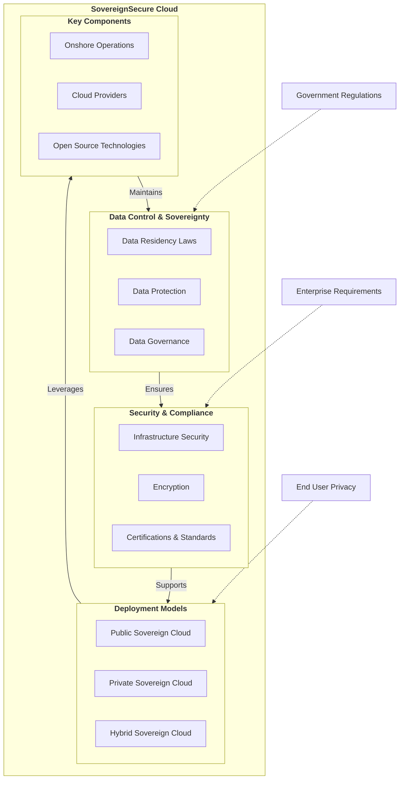

# Welcome to SovereignSecure Cloud Documentation

Welcome to SovereignSecure Cloud, your trusted platform for secure, compliant, and high-performance cloud services. Built on a foundation of OpenStack and enhanced with ManageIQ for comprehensive cloud management, we empower organizations to maintain full control over their data and operations within a sovereign digital environment.

## Our Commitment to Sovereignty

SovereignSecure Cloud is designed to meet the stringent requirements of data sovereignty, ensuring that your data remains within specified geographical and legal jurisdictions. We achieve this through:

*   **Data Residency:** Your data is stored and processed exclusively in designated regions, adhering to local regulations.
*   **Operational Autonomy:** Our infrastructure and operations are managed by local teams, ensuring transparency and control.
*   **Open Source Foundation:** Leveraging OpenStack and other open-source technologies minimizes vendor lock-in and provides a transparent, auditable stack.
*   **Robust Security & Compliance:** We implement advanced security measures and maintain certifications to protect your sensitive workloads.

## Explore the Documentation

Use the navigation on the left to explore our comprehensive guides:

## Key Sections

-   :material-rocket-launch:{ .lg .middle } __Getting Started__

    ---

    A step-by-step guide for new users to quickly onboard and deploy their first resources.

    [:octicons-arrow-right-24: Quick Start](quickstart/index.md)

-   :material-monitor-dashboard:{ .lg .middle } __Cloud Management (CMP)__

    ---

    Learn how to use the ManageIQ portal for self-service provisioning, catalogs, and reporting.

    [:octicons-arrow-right-24: CMP Overview](cmp/index.md)

-   :material-server-network:{ .lg .middle } __Core Services__

    ---

    Deep dive into our Compute, Storage, and Networking offerings, including GPU instances.

    [:octicons-arrow-right-24: Explore Services](compute/index.md)

-   :material-api:{ .lg .middle } __API & Automation__

    ---

    Integrate with our platform using OpenStack native APIs and IaC tools like Terraform.

    [:octicons-arrow-right-24: API Overview](api/index.md)

