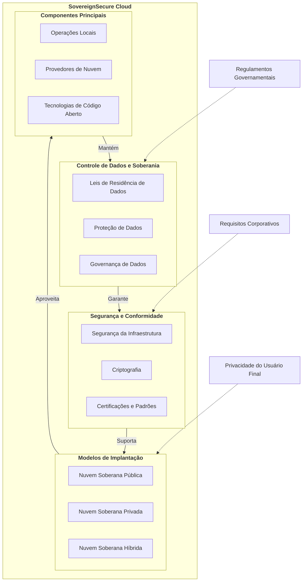

# Bem-vindo à Documentação da SovereignSecure Cloud 

Bem-vindo à SovereignSecure Cloud, sua plataforma de confiança para serviços em nuvem seguros, em conformidade e de alto desempenho. Construída sobre uma base de OpenStack e aprimorada com o ManageIQ para um gerenciamento abrangente da nuvem, capacitamos as organizações a manter controle total sobre seus dados e operações dentro de um ambiente digital soberano.

## Nosso Compromisso com a Soberania

A SovereignSecure Cloud foi projetada para atender aos rigorosos requisitos de soberania de dados, garantindo que seus dados permaneçam dentro de jurisdições geográficas e legais especificadas. Alcançamos isso através de:

*   **Residência de Dados:** Seus dados são armazenados e processados exclusivamente em regiões designadas, aderindo aos regulamentos locais.
*   **Autonomia Operacional:** Nossa infraestrutura e operações são gerenciadas por equipes locais, garantindo transparência e controle.
*   **Base de Código Aberto:** O uso do OpenStack e outras tecnologias de código aberto minimiza a dependência de fornecedores e fornece uma pilha transparente e auditável.
*   **Segurança e Conformidade Robustas:** Implementamos medidas de segurança avançadas e mantemos certificações para proteger suas cargas de trabalho confidenciais.

## Services Overview

-   :material-server:{ .lg .middle } __Compute__

    ---

    Scalable virtual machines, dedicated hosts, and high-performance computing resources.

    [:octicons-arrow-right-24: Explore Compute](product_content/compute.md)

-   :material-network:{ .lg .middle } __Networking__

    ---

    Virtual private clouds, load balancers, DNS, and content delivery networks.

    [:octicons-arrow-right-24: Explore Networking](product_content/networking.md)

-   :material-harddisk:{ .lg .middle } __Storage__

    ---

    Secure, durable, and scalable object, block, and file storage solutions.

    [:octicons-arrow-right-24: Explore Storage](product_content/storage.md)

-   :material-kubernetes:{ .lg .middle } __Containers__

    ---

    Run and manage containers with high reliability and scalability.

    [:octicons-arrow-right-24: Explore Containers](product_content/containers.md)

-   :material-database:{ .lg .middle } __Databases__

    ---

    Fully managed relational, NoSQL, and in-memory databases.

    [:octicons-arrow-right-24: Explore Databases](product_content/databases.md)

-   :material-chart-bar:{ .lg .middle } __Analytics__

    ---

    Get insights from your data with warehousing, processing, and visualization tools.

    [:octicons-arrow-right-24: Explore Analytics](product_content/analytics.md)

-   :material-robot-outline:{ .lg .middle } __AI + Machine Learning__

    ---

    Build, train, and deploy machine learning models with ease.

    [:octicons-arrow-right-24: Explore AI & ML](product_content/ai-machine-learning.md)

-   :material-api:{ .lg .middle } __API__

    ---

    Deploy API Gateway securely and at scale.

    [:octicons-arrow-right-24: Explore API](product_content/api.md)

-   :material-puzzle-outline:{ .lg .middle } __Integration__

    ---

    Seamlessly connect applications, data, and devices across your enterprise.

    [:octicons-arrow-right-24: Explore Integration](product_content/integration.md)

-   :material-shield-account-outline:{ .lg .middle } __Identity__

    ---

    Manage user identities, access policies, and secure authentication.

    [:octicons-arrow-right-24: Explore Identity](product_content/identity.md)

-   :material-security:{ .lg .middle } __Security__

    ---

    Protect your infrastructure and data with advanced security services.

    [:octicons-arrow-right-24: Explore Security](product_content/security.md)

-   :material-infinity:{ .lg .middle } __DevOps__

    ---

    Automate software delivery and infrastructure management.

    [:octicons-arrow-right-24: Explore DevOps](product_content/devops.md)

-   :material-briefcase-check-outline:{ .lg .middle } __Management and Governance__

    ---

    Control costs, compliance, and configuration of your cloud resources.

    [:octicons-arrow-right-24: Explore Management](product_content/management-governance.md)

-   :material-cloud-upload-outline:{ .lg .middle } __Migration__

    ---

    Simplify and accelerate your migration to the cloud.

    [:octicons-arrow-right-24: Explore Migration](product_content/migration.md)

## Explore a Documentação

Use a navegação à esquerda para explorar nossos guias abrangentes:

## Seções Principais

-   :material-rocket-launch:{ .lg .middle } __Primeiros Passos__

    ---

    Um guia passo a passo para novos usuários se integrarem rapidamente e implantarem seus primeiros recursos.

    [:octicons-arrow-right-24: Início Rápido](quickstart/index.md)

-   :material-monitor-dashboard:{ .lg .middle } __Gerenciamento de Nuvem (CMP)__

    ---

    Aprenda a usar o portal ManageIQ para provisionamento de autoatendimento, catálogos e relatórios.

    [:octicons-arrow-right-24: Visão Geral do CMP](cmp/index.md)

-   :material-server-network:{ .lg .middle } __Serviços Principais__

    ---

    Aprofunde-se em nossas ofertas de Computação, Armazenamento e Redes, incluindo instâncias de GPU.

    [:octicons-arrow-right-24: Explorar Serviços](compute/index.md)

-   :material-api:{ .lg .middle } __API e Automação__

    ---

    Integre-se à nossa plataforma usando APIs nativas do OpenStack e ferramentas de IaC como Terraform.

    [:octicons-arrow-right-24: Visão Geral da API](api/index.md)

